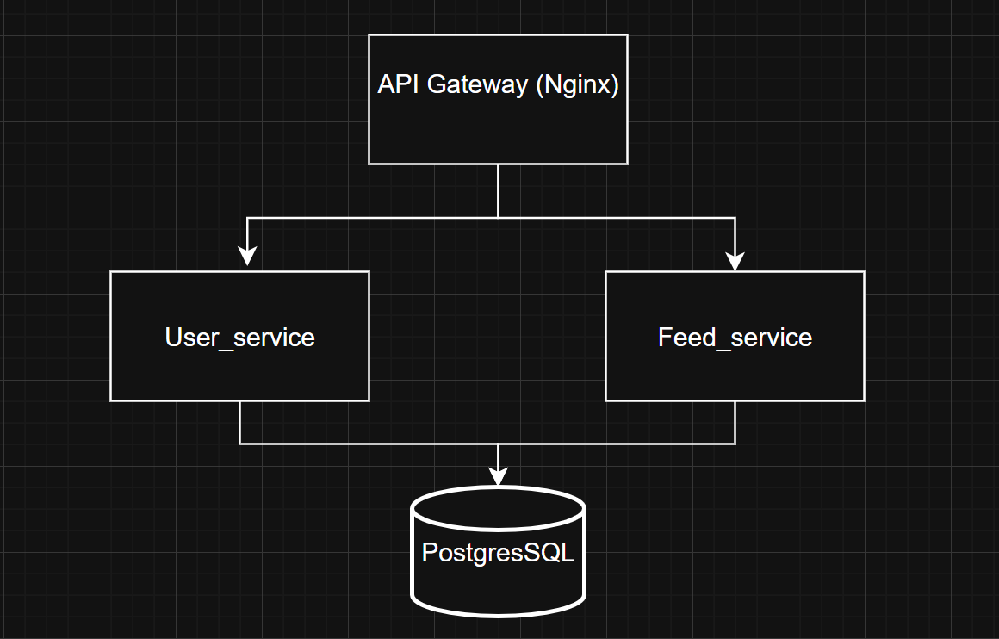

# Социальная сеть для путешественников с микросервисной архитектурой.

Что создаём? Социальная сеть для путешественников, предназначенная для публикации постов о различных маршрутах и турах.

### 1.Как создаём?
Данный продукт состоит из двух микросервисов: 

#### User Service: Хранение личной информации пользователя, любимые категории путешествий; Регистрация + авторизация; Написание и публикация постов.
    
#### News_feed Service: Новостная лента со всеми написанными пользователями постами и фильтрацией по категориям, Поиск мест рядом по геолокации.

### 2.Архитектура и зависимости

### API Gateway (Nginx)
Назначение: единая точка входа для всех клиентов

#### Функции:
Маршрутизация запросов к микросервисам
Балансировка нагрузки
SSL/TLS терминация
Rate limiting (ограничение запросов)
CORS настройки

#### Зависимости:
завист от всех микросервисов

### User Service (FastAPI + Python)
Назначение: управление пользователями и аутентификацией

#### Компоненты:
Регистрация/авторизация
JWT токены
Управление профилем

#### Зависимости:
База данных 

### Feed Service (FastAPI + Python)
Назначение: формирование ленты новостей

Компоненты:
Генерация ленты
Фильтрация по геолокации
Сортировка и пагинация
Создание/редактирование постов
Комментари
#### Зависимости:
База данных
User Service (для получения информации о пользователях, для получения постов)

### 3.Способы запуска сервиса

### 4.API документация

### 5.Как тестировать

### 6.Контакты и поддержка
